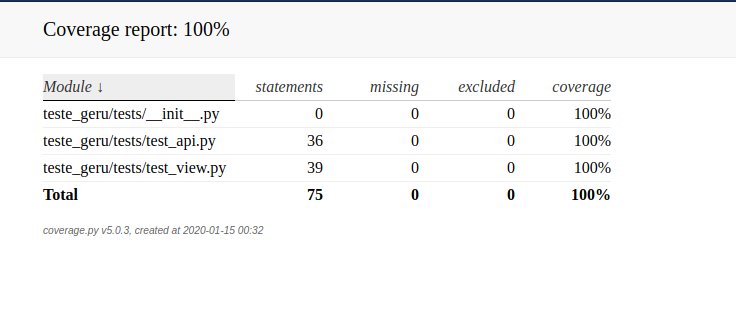

# Desafio Geru

Esse desafio é composto de algumas etapas. O intuito não é de forma alguma que se tenha que implementa-lo completamente para qualquer consideração de contração.

Dica 1: Fique tranquilo e tente resolvê-lo como se estivesse estudando algo novo que queira aprender.

O objetivo desse pequeno desafio é compreender quais conhecimentos você já possui e sua desenvoltura diante a problemas ou tarefas que esteja se deparando pela primeira vez.

Imagine que o resultado do seu trabalho será um projeto público que será utilizado por várias pessoas. Sendo assim, aplique neste projeto as boas práticas de desenvolvimento de software que você conhece.

Quando terminar, criar um repositório **privado** no github (caso possa criar repositório privado) ou bitbucket (repositório privado grátis) com acesso para o usuário **geru-challenge**
 
Bom trabalho ;)

## Considerações:
A API descrita abaixo será utilizada nos desafios:

Utilizaremos nesse desafio uma API RESTful com os seguintes recursos:

* /quotes que retorna json no formato:
```
      {
          "quotes": [
              "quote 1.",
              "quote 2.",
              ...
          ]
      }
```

* /quotes/<quote_number\> que retorna json no formato:
```
      {
       "quote": "Aqui está o quote correspondente ao <quote_number>."
      }
```
Exemplo:
```
GET /quotes/2
{
 "quote": "quote 2."
}
```
Essa API está disponível em: https://1c22eh3aj8.execute-api.us-east-1.amazonaws.com/challenge/quotes


## Desafios

### 1) Criar uma lib para a API descrita na introdução.

Criar um pacote python no projeto para realizar consultas à API contendo as seguintes funções:
```
    get_quotes() -> consulta API e retorna dicionário python contendo os quotes
    get_quote(quote_number) -> Consulta API e retorna o quote correspondente
```

### 2) Criar uma aplicação pyramid[1] para uso da API.

[1] https://docs.pylonsproject.org/projects/pyramid/en/latest/

A aplicação deve ter 4 rotas:

 *  “/” - Apresenta página HTML simples contendo título "Desafio Web 1.0"
 *  “/quotes” - Apresenta página contendo as frases em bullet points todos os quotes retornados pela API.
 *  “/quotes/<quote_number\>” - Apresentar página contendo o quote retornado pela API correspondente ao <quote_number\>.
 * “/quotes/random” - Apresentar página contendo um quote randômico. Exibir o quote_number sorteado e o quote correspondente.


### 3) Criação e registro de sessão.
Utilizando o mecanismo de sessão do framework criar um identificador único para todos os acessos a aplicação originadas de um mesmo browser.

### 4) Gravar os acessos em um banco de dados.

Utilizando SQLAlchemy + sqlite criar modelo/modelos para registrar:
- Identificador da sessão
Para cada consulta registrar:
- Data, hora e página acessada dentro de uma sessão.

### 5) Criar endpoints RESTful para visualização das sessões/consultas.  

# Resultado do Desafio

* Rodar a Aplicação

```
git clone https://github.com/Hp2501/Teste_Geru_.git
cd Teste_Geru_
python3 -m venv .venv
. .venv/bin/activate
pip install -e ".[dev]"
pip install -e ".[testing]"
alembic upgrade head
pserve development.ini --reload
```

* Rotas da Aplicação

```
http://localhost:6543/
http://localhost:6543/quotes
http://localhost:6543/quotes/<number_quote>
http://localhost:6543/quotes/random
```
* Rotas da Api

```
http://localhost:6543/api/v1/sessions
http://localhost:6543/api/v1/sessions/<id_session>
```

* Rodar os testes
```
no diretório raiz executar o comando
pytest --cov=teste_geru/tests/
```


